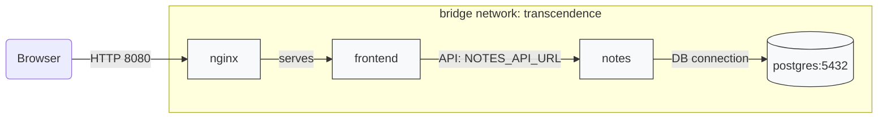
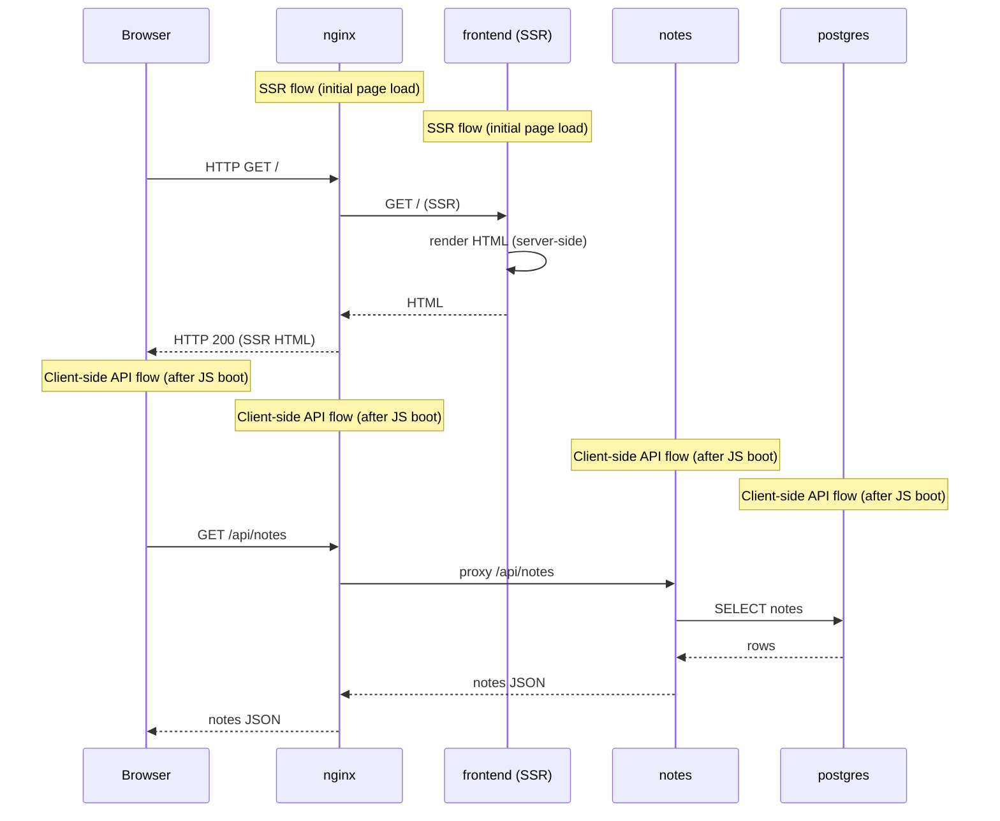
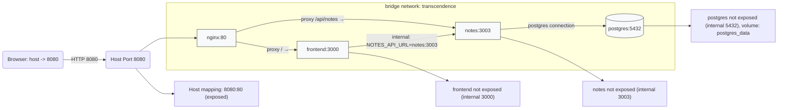

# Container deployment diagrams 🚢

This document contains Mermaid diagrams that explain the container deployment defined in `srcs/docker-compose.yml`.

> Two diagrams are included:
> - **Topology flowchart** (service connections and ports) ✅
> - **Request sequence diagram** (typical browser → service request flow) ⏱️

---

## Topology (Flowchart) 🔧

---

## Request flow (Sequence diagram) 🔁

---

## Notes & rendering tips 💡

- These diagrams reflect services defined in `srcs/docker-compose.yml` (frontend, notes, nginx, postgres).
- To render Mermaid locally, use a Markdown viewer/extension that supports Mermaid (e.g., VS Code "Markdown Preview Mermaid Support") or the official Mermaid Live Editor: https://mermaid.live/

---

## Network topology (Ports) 🌐🔌

---

*File generated by GitHub Copilot.*
