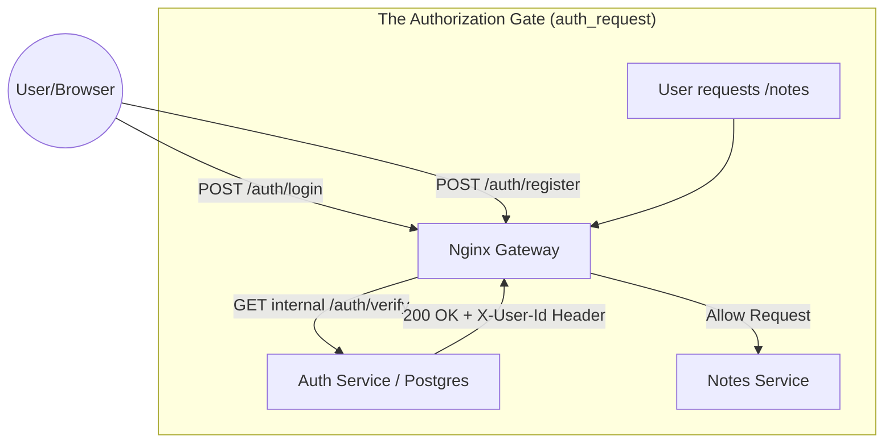
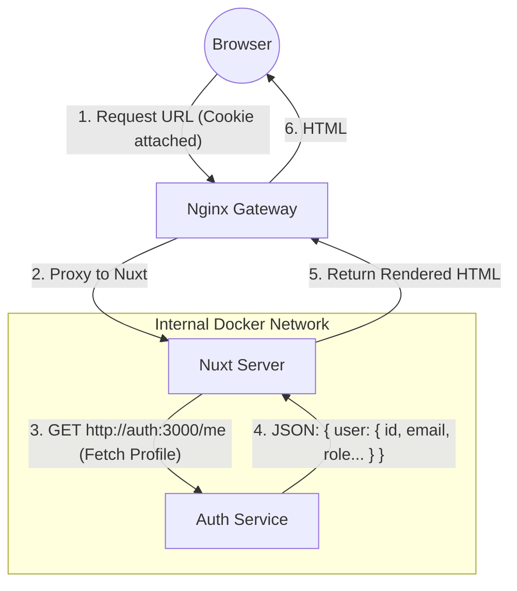

# Auth Service

An ultra-efficient Authentication service built with Fastify, TypeScript, and Drizzle ORM. It handles multi-strategy authentication (Local + GitHub OAuth2) and session management.

---
## Database Migration Commands

When you change the [schema.ts](src/db/schema.ts), you must synchronize the database. We use a two-step "Generate & Push" workflow.

DB UPDATE Command Example
`docker exec -i postgres psql -U auth_user -d auth_db -c "UPDATE accounts SET provider_account_id = user_id::text WHERE provider = 'local';"`

### 1. Generate Migration Files
This looks at your TypeScript schema and creates the SQL equivalent in `./drizzle`.
This must be done if this is the first time we run the program (if we dont have initial file yet)

```bash
pnpm db:generate
```

### 2. Push to Database
This executes the SQL against your running Postgres container.
```bash
pnpm db:push
```

> **Note:** For development, `db:push` is the fastest way to sync. In a production environment, you would typically use `db:migrate` to run the versioned SQL files sequentially.

---
## Routes & Auth Flow Diagrams
*Scroll all the way to the end*

## Architectural Decisions

We follow a strict Separation of Concerns to ensure the code is both robust and testable (using Vitest + Supertest).

### 1. App Creation vs. Service Launch
To test a server without actually binding to a network port (which is slow and port-conflicts), we split the logic:
- [src/app.ts](src/app.ts) (The Recipe): Defines all routes, plugins (OAuth, Cookies), and database decorators. It returns a FastifyInstance.
- [src/index.ts](src/index.ts) (The Launcher): Loads environment variables/secrets (`loadConfig`), builds the server using the "recipe," and calls `server.listen()`.

### 2. Testing Isolation
In [src/tests/auth.test.ts](src/tests/auth.test.ts), we use the "recipe" `buildServer()` to create a temporary instance. This allows us to inject requests directly into the application logic using Fastify's `.inject()` method, bypassing the need for a real Nginx or network connection during tests.

---

## Features

- Multi-Strategy Auth: 
    - Local: Argon2 password hashing (slow/secure by design).
    - GitHub OAuth2: Dynamic callback construction using request headers.
- Session Management: HMAC-signed cookies (@fastify/cookie).
- Database: Drizzle ORM targeting PostgreSQL.
- Validation: Schema-based validation using TypeBox for every route.
- Visual Logging: Custom test logging for debugging request/response flows.

---

## Endpoints & Wiring Guide

When configuring Nginx or other services, it helps to visualize how the Auth service fits into the mesh.

### Service Flow Diagram

### SSR Data Fetching Flow (Server-Side)

When the user first loads the page (Hard Refresh), Nuxt needs to know who they are *before* rendering the HTML.



---

## The "Thin Gate" Protocol

We distinguish between **Access** (is the door open?) and **Identity** (who is walking through?).

| Endpoint | Logic Type | Returns | Use Case |
| :--- | :--- | :--- | :--- |
| `GET /verify` | **Thin Gate** | `userId`, `sessionId` | Nginx `auth_request` / Fast Auth Checks. No DB Joins. |
| `GET /me` | **Thick Check** | Full `User` Object | Frontend Profile rendering / Admin Role checks. |

---

### Endpoint Reference

These are the routes exposed by the AUTH container on port `3000`.

| Method | Endpoint | Purpose | Wiring Context |
| :--- | :--- | :--- | :--- |
| **GET** | `/verify` | **Checks session cookie.** <br> **Status:** `200 OK`. <br> **Body:** `{ authenticated: true, session }`. <br> **Headers:** Sets `X-User-Id` for Nginx. | Used by Nginx `auth_request` directive. Fast session lookup. |
| **GET** | `/me` | **The Profile Identity.** <br> **Status:** `200 OK`. <br> **Body:** `{ authenticated: true, user: { id, loginName, email, role, ... } }`. | Used by Frontend (SSR & Client) to fetch full User information. |
| **GET** | `/resolve` | **User Identity Resolution.** <br> **Accepts:** `?identifier=<email_or_login>` <br> **Returns:** `{ user: { id, loginName, imageURL } }` | Used by Share Flow to convert human identity to UUID. |
| **POST** | `/logout` | **Clears session cookie.** | Called by frontend button. |
| **POST** | `/login` | Accepts `{ identifier, password }`. Sets cookie. | Public form submission. |
| **POST** | `/register` | Accepts `{ loginName, email, password }`. Sets cookie. | Public form submission. |
| **GET** | `/login/github` | Redirects browser to GitHub. | Link from "Login with GitHub" button. |
| **GET** | `/` | Health check / Redirect logic. | Default route. |
| **GET** | `/users` | Returns all registered users (`id`, `loginName`, `imageURL`). | Used by frontend share dialog. |
| **PATCH** | `/change-login` | Updates `loginName`. Accepts `{ loginName }`. | Profile settings. |
| **PATCH** | `/change-email` | Updates `email`. Accepts `{ email }`. | Profile settings. |
| **PATCH** | `/change-image` | Sets or clears profile picture URL. Accepts `{ imageURL }`. | Profile settings. |
| **POST** | `/change-password` | Updates or creates local password. Accepts `{ oldPassword, newPassword }`. | Profile settings. |
| **GET** | `/export-data` | GDPR-style export of user profile, accounts, sessions, and notes. | Profile settings. |
| **DELETE** | `/delete-account` | Deletes user, their notes, and linked data. Clears session cookie. | Profile settings. |

---

## Development Workflow

### 1. Local Development (No Docker)
If you have a local Postgres instance running:
```bash
pnpm install
pnpm run dev
```

### 2. Development (With Docker)
Uses Dockerfile.dev with tsx for high-speed hot-reloading.
```bash
docker compose up auth --build
```

### 3. Running Tests
Tests use a dedicated integration setup.
```bash
# Inside the container
pnpm test

# From the host (USE THIS WHILE RUNNING ENTIRE APPLICATION)
docker compose exec auth pnpm test
```

---

## Production Deployment

We use a Multi-Stage Dockerfile to minimize the final image size and exclude development tools like typescript or vitest.

### The Production Build Process
1. Builder Stage: Compiles .ts files into the `dist/` folder using tsc.
2. Runner Stage: Only copies the compiled `dist/`, the production node_modules (no devDeps), and the drizzle migrations.

### Production Runtime
In a production environment, use the production Dockerfile (rather than Dockerfile.dev) to ensure the service runs the compiled JavaScript via the standard node runtime. This is typically managed via the overarching docker-compose configuration.

---

## Project Structure

- [src/app.ts](src/app.ts): Core application assembly.
- [src/index.ts](src/index.ts): Entry point (Config loading + Process handling).
- [src/db/](src/db/): Database schema definitions and connection pooling.
- [src/routes/](src/routes/): Route handlers split by domain (Auth, Sessions, User).
- [src/lib/](src/lib/): Pure helpers and utility logic (URL construction, session helpers).
- [src/tests/](src/tests/): Integration and unit tests.
