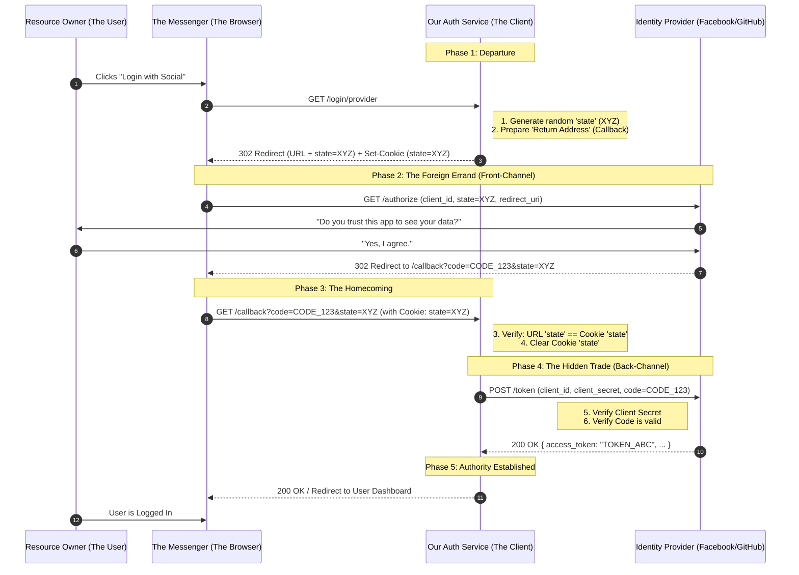

In our quest for structural clarity, we must visualize the system as a series of coordinated hand-offs. In the grammar of OAuth2, we separate the "Front-Channel" (the visible journey of the messenger) from the "Back-Channel" (the hidden, trusted trade between servers).

### The Atomic OAuth2 Flow: The "Two-Channel" Dance

---

### Deconstructing the Flow: The Principles of Trust

To understand this flow from first principles, we must look at why the "Messenger" (the Browser) is never trusted with the "Final Secret" (the Token).

#### 1. The Generation of the Shield (Step 3 & 4)
When you call `register` or `generateAuthorizationUri`, your server (the "Client") creates a random string of characters called a **Nonce**. 
*   **The URL**: Sent to the Provider so they can echo it back.
*   **The Cookie**: Stored in the Browser so we can verify the echo.
This ensures that the "Return Journey" (Step 10) is linked to the "Departure" (Step 4).

#### 2. The Front-Channel (Steps 5 through 10)
This is the "Visible" part of the internet. The data passes through the user's address bar. 
*   **The Problem:** Anyone watching the user's screen or the browser history can see the `code=CODE_123`.
*   **The Truth:** Because it is visible, the **Code** is not the final key. It is merely a "One-Time Claim Ticket." Even if an attacker steals the code, they cannot use it without your `client_secret`, which never leaves your server.

#### 3. The Back-Channel (Steps 12 & 13)
This is a **Secret Dialogue** between two servers. Our Auth Service calls Facebook directly. 
*   The Browser never sees this conversation. 
*   This is where we trade the "Claim Ticket" (the Code) and our "Store Key" (the Client Secret) for the **Access Token**.
*   In C++98 terms, this is a **Private Interface**. Only our server and Facebook’s server have the credentials to access this specific socket.

#### 4. The Validation of Identity (Step 11)
When the browser returns, we perform the `state` check we discussed. This is the **Integrity Guard**. 
*   If we did not check the state, an attacker could force a "Login Success" message into our system without the User's consent. 
*   The state check proves that the User who is "Coming Home" is the same User we sent out.

**In summary:** We use the User as a messenger to get a "Ticket" (the Code), but we only perform the "Real Work" (the Token Trade) in a private room where the messenger cannot listen. Does this division between the "Public Street" and the "Private Room" clarify why there are so many steps?

---
