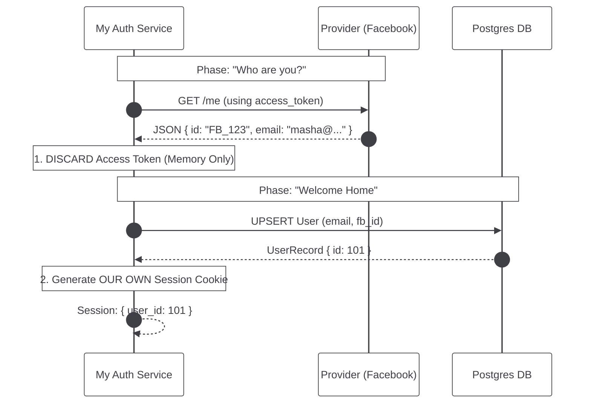
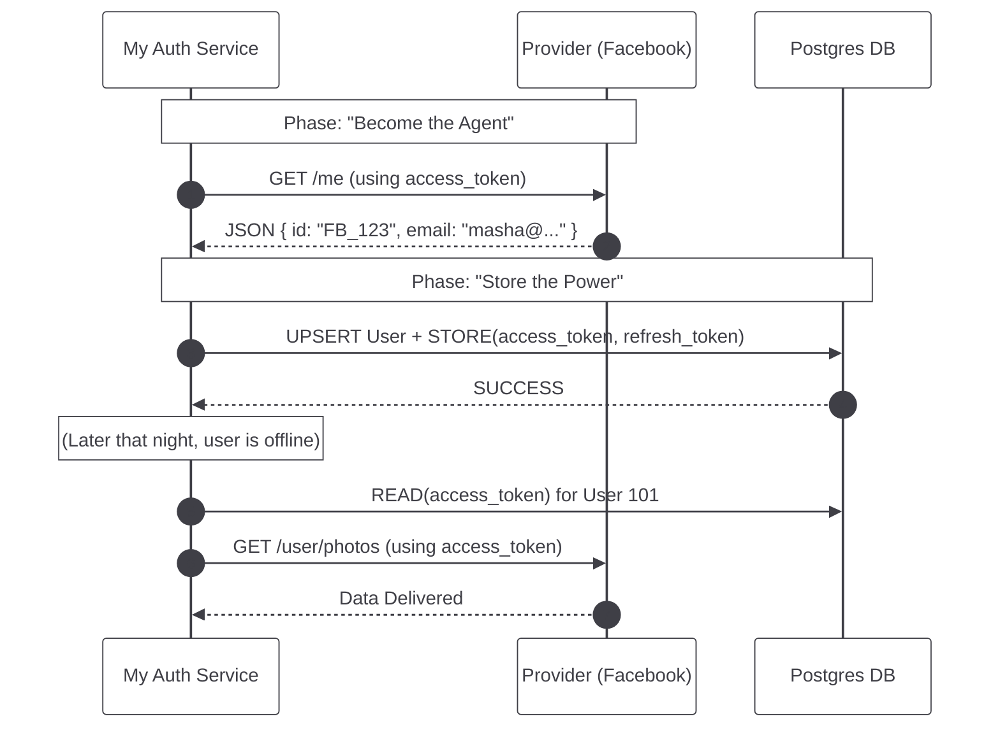
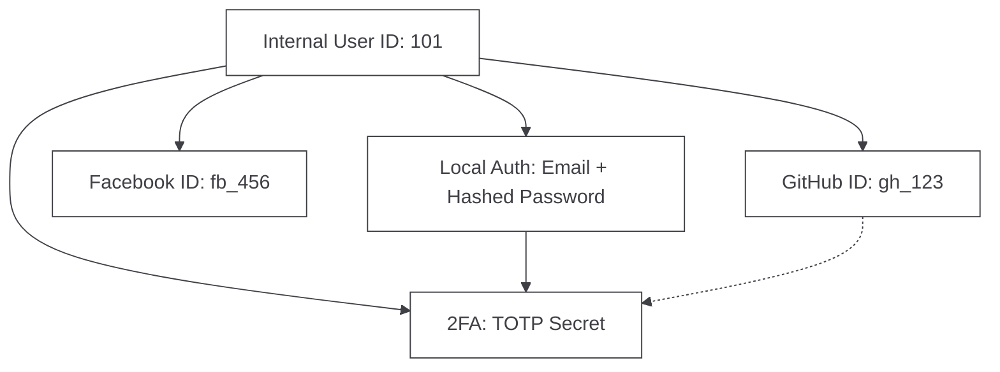
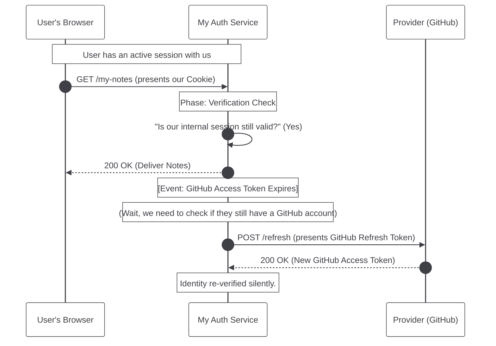

In our quest for structural integrity, we must distinguish between **Checking an Identity** and **Becoming a Representative**. You have correctly identified that there are different "Options" based on the **Atomic Goals** of your application.

Here are the two primary paths we can take after receiving the `access_token` from the Provider for the first time.

---

### Option 1: The "Identity Verification" Path (Social Login)
In this scenario, we only care about **who** the user is. We use the Provider as a "Trusted Verifier" and then we throw the key away.



**The Logical Truth:** We treat the `access_token` like a **Temporary Visitor's Badge**. We use it once to look at their ID card, then we shred the badge. 
*   **Storage:** We only store the User's Email and their `provider_id` (so we know who they are next time they return).
*   **Pros:** Very secure. If our database is stolen, the hackers don't get the user's Facebook password or keys.
*   **Cons:** We cannot "do" anything in Facebook later.

---

### Option 2: The "Continuous Integration" Path (The Agent)
In this scenario, we want to act on the user's behalf even when they are asleep. We are building a "Representation" of the user.



**The Logical Truth:** We treat the `access_token` like a **Key to the User's House**. We put it in our vault (`postgres`) so we can enter their house (Facebook) and perform chores (read data) whenever we need to.
*   **Storage:** We store the Email, the `provider_id`, the `access_token`, and the `refresh_token`.
*   **Pros:** Powerful. We can sync notes across platforms or fetch content automatically.
*   **Cons:** High risk. If our database is stolen, the hackers can now "act" as our users on Facebook.

---

### The C++98 Comparison: Transient vs. Persistent State

Think of these two options as different ways of handling a **Resource Handle**:

*   **Option 1 (Transient):**
    ```cpp
    void handleLogin(Token t) {
        User u = Provider::fetchUser(t); // Use the handle briefly
        Database::sync(u);              // Save the person, not the handle
        // Token 't' goes out of scope and is deleted.
    }
    ```

*   **Option 2 (Persistent):**
    ```cpp
    void handleIntegration(Token t, RefreshToken r) {
        User u = Provider::fetchUser(t);
        Database::sync(u);
        Database::storeCredentials(u.id, t, r); // Save the handle for later use
    }
    ```

**In our Note-Taking App:** You must decide what your mission is. If you just want them to log in, use **Option 1**. If you want to "Import notes from GitHub," you must use **Option 2**.

---

### Option 3: The "Hybrid Authority" (The Multi-Key Record)
In this scenario, we decouple the User's existence from any single third party. We treat our app as the "Master" and allow multiple ways to prove identity.



**The Logical Truth:** We treat the User as a **Citizen** of our app, not just a guest of a Provider.
*   **Storage:** `user_id`, multiple `provider_id`s, local credentials (hashed), and optional 2FA secrets.
*   **2FA (Two-Factor):** An additional "Challenge-Response" layer required regardless of the login method.
*   **Pros:** Total resilience. If GitHub is deleted, the user logs in with their Password or Facebook. No data is lost.
*   **Cons:** Higher complexity in the `auth` service.

---

### The Lifespan of a Credential
 To answer your question rigorously: **In Option 1 (Identity Verification), Refreshing typically does not fit at all.** 

To understand why, we must deconstruct the "Succession of Authority."

### 1. The Hand-off of the "Master"
In **Option 1**, the Provider (GitHub/Facebook) is merely a **Witness**.
*   **The Moment of Login:** GitHub says, *"Yes, this is Masha."*
*   **The Transition:** You create a row in your `postgres` DB and issue **Your Own Session Cookie** (e.g., valid for 30 days).
*   **The Result:** From that second onward, your server is the "Master" of Masha's session. You no longer care if GitHub's 1-hour `access_token` expires, because you aren't using it for anything. You have already "Verified the Passport" and issued an "Internal ID Card."

### 2. When Refreshing *Does* Happen (The Identity Loop)
The only time refreshing fits into an Identity path is if you want to **Continuously Re-Verify** that the user's GitHub account is still active *without* making them click a button.



### 3. The Atomic Difference
*   **Option 2 (The Agent):** Refreshing is **Required**. You need a fresh key to keep reading their files or posting to their wall while they are away.
*   **Option 1 (The Social Login):** Refreshing is **Optional/Rare**. Most apps simply wait for their *own* session to expire. When it does, they just send the user through the "Departure Gate" again. If the user is still logged into GitHub, the process takes 0.5 seconds and feels "silent" anyway.

### The C++98 Analogy: The Cache vs. The Connection
Think of **Option 1** like a **DNS Cache**.
*   You ask the DNS server (GitHub) for an IP (Identity).
*   You store that IP in your local cache for 24 hours.
*   Even if the DNS server goes down or the original record changes, you keep using your cache until it expires. You don't need to "Refresh" the DNS link every minute.

**In summary:** In most "Identity" scenarios, we don't store the refresh token at all. We trust our own session once the identity is proven. We only keep the refresh token if we plan to act as an "Agent" (Option 2) or if we want a very strict, real-time link to the user's social account status.

Does this clarify why "Refreshing" feels like it belongs more to the powerful "Agent" path than the simple "Social Login" path?