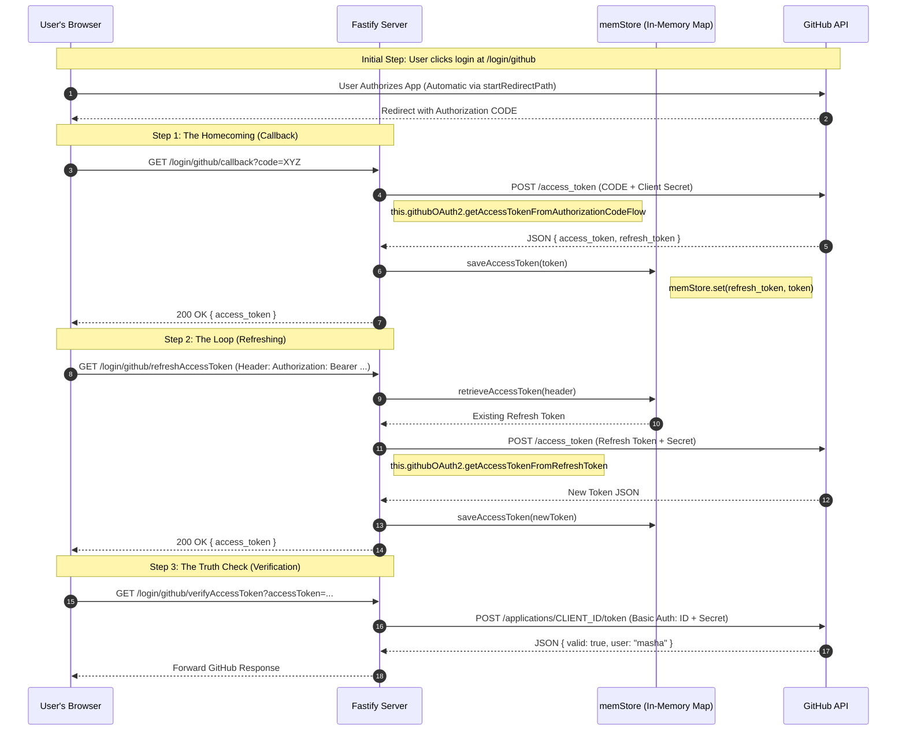

To understand this example with **Structural Rigor**, we must visualize the **Triangular Trust** between the User's Browser, your Fastify Server, and the GitHub API.

The following diagram deconstructs how the `memStore` acts as a "Vault" and how the specific routes navigate the "Public Street" (the Browser) and the "Secure Backdoor" (the Server-to-Server connection).



### The Atomic Breakdown of Functions:

1.  **`this.githubOAuth2`**: This is a **Decorated Property**. When you registered the plugin, it "added" this tool to your `fastify` server object.
2.  **`getAccessTokenFromAuthorizationCodeFlow(request)`**: This is the **Heavy Lifter**. It extracts the `code` from the URL, combines it with your `Client Secret`, and performs the secure server-to-server exchange with GitHub.
3.  **`memStore` (The Map)**: This is our **Simulation of a Database**. 
    *   **Logic Check:** It uses the `refresh_token` as the **Primary Key**. Why? Because the `access_token` expires in an hour, but the `refresh_token` is the "Eternal Key" we use to find our identity again.
4.  **`retrieveAccessToken`**: This is a **Sanitizer**. It ensures that if a user sends `"Bearer abcd"`, we strip the word `"Bearer "` away to get the raw `"abcd"` key.

---

### The C++98 Comparison: The Decorator Pattern

Think of this like adding a module to an existing object:

```cpp
// The Fastify Server object
Server server;

// The Plugin acts as a 'Decorator' 
// It adds a 'OAuthModule' to our server instance
server.addModule(new OAuthModule(githubConfig));

// Later, inside a request handler:
void onCallback(Request& req) {
    // We access the module we added earlier
    Token* t = server.oauthModule->exchangeCodeForToken(req.query["code"]);
    db.save(t);
}
```

### The Professor's Prescription
In our **Option 1** (The Witness) strategy:
*   We **Discard** Step 2 (Refreshing).
*   We **Discard** Step 3 (Verification).
*   We **Keep** Step 1 (The Homecoming), but instead of saving the `token` in a `Map`, we will use the `access_token` once to get the user's name/email, save **THAT** in Postgres, and then throw the token away.

Does the **Structural Flow** of this example feel like a clear blueprint for your final index.ts, or should we look closer at a specific line?