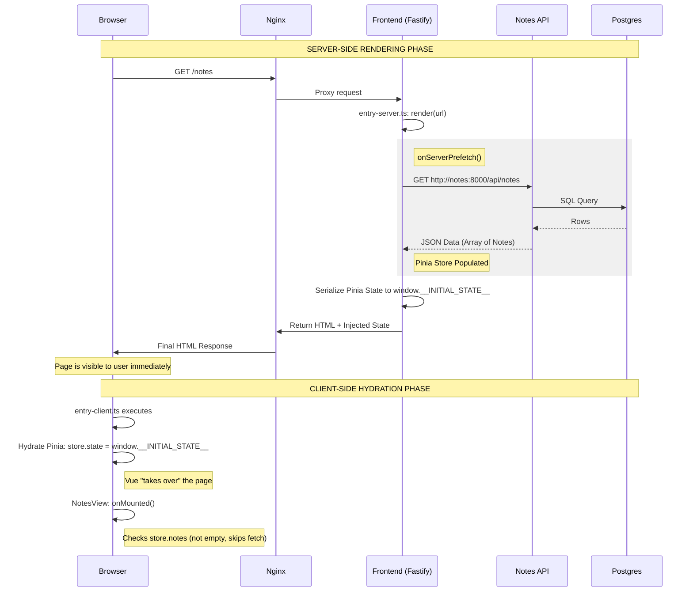

## SSR 
Here is a diagram showing how data flows from your database all the way to the user's browser during an SSR request.

### Key Technical Details in your flow:

1.  **The "Shortcut"**: In the diagram, notice the Frontend talks directly to the **Notes API** over the internal Docker network (`http://notes:8000`). This is fast and secure because it never leaves the "internal network."
2.  **The Serialization**: We convert the Pinia data into a string and put it in a `<script>` tag. This is how the server "hands the baton" to the browser.
3.  **The Hydration**: When the browser loads the JavaScript, it checks that script tag. If the data is there, Pinia fills it up instantly. This prevents that annoying flicker where a list is empty for half a second before loading.
4.  **`onServerPrefetch`**: This is the "magic" hook that forces the server to pause and wait for the database results before it is allowed to finish rendering the HTML.