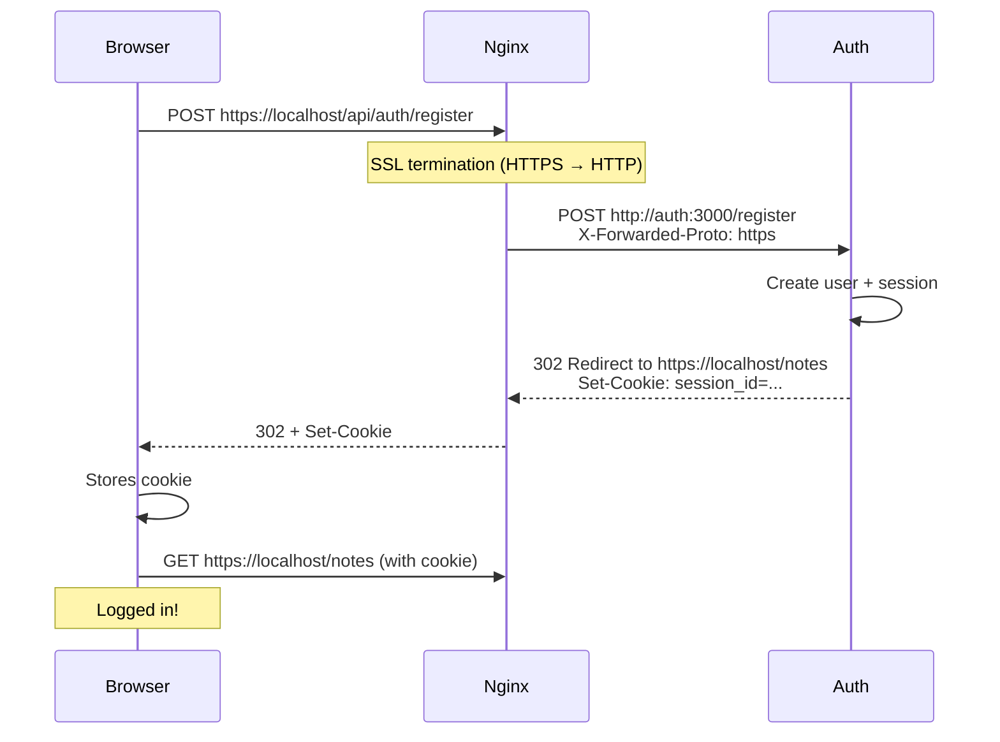
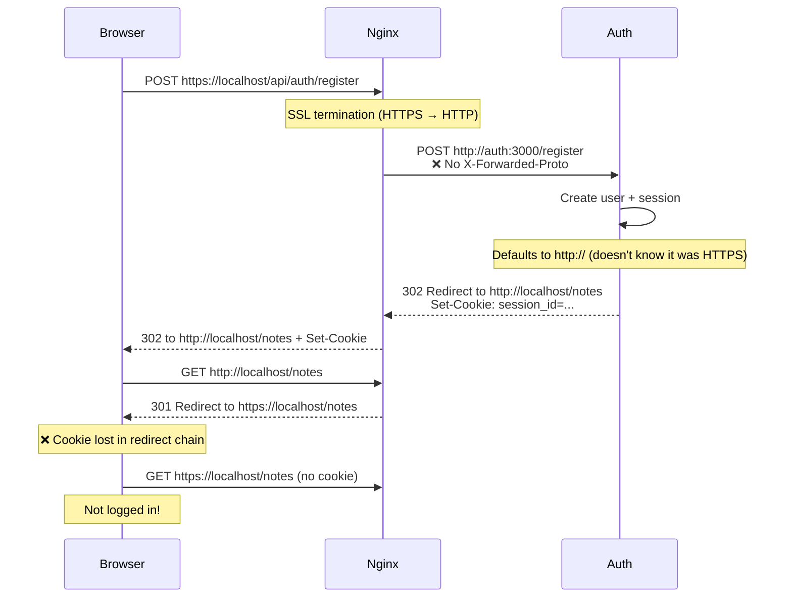

# Auth Registration Flow

## How registration works through Nginx

## The bug (before the fix)

## Fix

Added `proxy_set_header X-Forwarded-Proto $scheme;` to the `/api/auth` location block in `nginx.conf`, so the auth service knows the original protocol.
