# Tiptap + Yjs Integration — Summary

Quick-reference guide. For detailed design docs, see the [collab/](collab/) directory: [overview](collab/overview.md), [tiptap-yjs-integration](collab/tiptap-yjs-integration.md), [websocket-provider](collab/websocket-provider.md), and [live-cursors](collab/live-cursors.md).

---

## Architecture Overview

Three files make up the collaboration system on the frontend:

| File | Role |
|---|---|
| `src/components/notes/NoteEditor.vue` | UI — Tiptap editor + title input, consumes the composable |
| `src/composables/useCollaboration.ts` | Glue — accepts a noteId getter; creates Y.Doc, Awareness, and Provider; watches for note changes and seamlessly swaps connections after first sync |
| `src/collaboration/WebSocketProvider.ts` | Transport — sends/receives binary Yjs updates and awareness over WebSocket |

### How they connect

Three-tier separation — each layer only talks to its immediate neighbour:

```
UI (NoteEditor)  ←→  Glue (useCollaboration)  ←→  Transport (WebSocketProvider)
   Vue refs              Y.Doc + Awareness              WebSocket + binary protocol
   template bindings     observe/transact                send/receive Uint8Arrays
```

#### NoteEditor.vue — the UI layer

Pure presentation. Holds no collaboration logic — only destructures the composable's return value and binds it to the template. Always editable (no view/edit toggle).

**What gets rendered:**

```
┌─────────────────────────────────────────────┐
│  Card                                       │
│  ┌───────────────────────────────────────┐  │
│  │ Title area                            │  │
│  │  [title input field]                  │  │
│  └───────────────────────────────────────┘  │
│  ┌───────────────────────────────────────┐  │
│  │ Content area                          │  │
│  │                                       │  │
│  │  Rich text editor (bold, headings..)  │  │
│  │                                       │  │
│  │  "3 users editing"                    │  │
│  └───────────────────────────────────────┘  │
└─────────────────────────────────────────────┘
```

```mermaid
flowchart TD
    subgraph props_layer["Props"]
        prop_noteId["defineProps&lt;{ noteId: string }&gt;#40;#41;"]
    end

    subgraph script["Script — what runs when the component loads"]
        subgraph composable_call["Composable call"]
            call["useCollaboration#40;#40;#41; => props.noteId#41;"]
            destructure["Destructures:<br/>ydoc — shallowRef&lt;Y.Doc&gt;<br/>provider — shallowRef&lt;WebSocketProvider&gt;<br/>titleText — ref&lt;string&gt;<br/>connectedUsers — ref&lt;number&gt;<br/>updateTitle — #40;text: string#41; => void"]
        end

        subgraph editor_setup["Editor setup"]
            editor_ref["const editor = shallowRef&lt;Editor&gt;#40;#41;<br/>starts as undefined"]
            watchEffect["watchEffect#40;onCleanup#41;"]
            guard["if #40;!ydoc.value || !provider.value#41; return<br/>— early exit until both refs are populated"]
            create_editor["new Editor#40;{ extensions: ... }#41;"]
        end

        subgraph extensions["Editor extensions"]
            starter["StarterKit.configure#40;{ undoRedo: false }#41;<br/>bold, italic, headings, lists, code blocks<br/>built-in undo disabled — Collaboration provides CRDT-aware undo"]
            collab_ext["Collaboration.configure#40;{ document: doc }#41;<br/>connects editor to Y.Doc XmlFragment"]
            caret_ext["CollaborationCaret.configure#40;{<br/>  provider: prov,<br/>  user: { name: 'Anonymous', color: '#958DF1' }<br/>}#41;<br/>shows colored cursors for other users"]
        end

        assign["editor.value = ed<br/>— triggers Vue re-render"]
        cleanup["onCleanup#40;#40;#41; => ed.destroy#40;#41;#41;<br/>— destroys old editor when ydoc/provider change"]
    end

    prop_noteId --> call
    call --> destructure
    destructure --> watchEffect
    editor_ref --> watchEffect
    watchEffect --> guard --> create_editor
    create_editor --> starter & collab_ext & caret_ext
    starter --> assign
    collab_ext --> assign
    caret_ext --> assign
    assign --> cleanup

    subgraph template["Template — what the user sees"]
        card["Card pt:root:class='card-document'"]

        subgraph title_slot["#title slot"]
            input["InputText<br/>:model-value=titleText — displays title from Y.Doc<br/>@update:model-value=updateTitle — sends typed title to Y.Doc<br/>placeholder='Title'<br/>fluid"]
        end

        subgraph content_slot["#content slot"]
            flex_col["div.flex.flex-col.gap-4.h-full"]
            editor_content["EditorContent :editor=editor<br/>class='tiptap-editor'<br/>renders nothing until editor is created<br/>then shows the rich text editor"]
            users["span v-if='connectedUsers > 1'<br/>class='text-sm text-gray-500'<br/>hidden when alone, shows '3 users editing' when others are connected"]
        end

        card --> title_slot
        card --> content_slot
        flex_col --> editor_content
        flex_col --> users
    end

    destructure -- "titleText" --> input
    destructure -- "updateTitle" --> input
    destructure -- "connectedUsers" --> users
    assign -- "editor" --> editor_content
```

**How each part syncs collaboratively:**

- **Editor content** — handled automatically by the Collaboration plugin. Unlike the title, you never touch the Y.Doc directly:


Compare with the title: for the title, we manually write (`updateTitle`) and manually read (`yTitle.observe`). For editor content, the Collaboration plugin does both automatically. Same Y.Doc, same WebSocket, but the plugin handles the wiring instead of us.

- **Title** — synced manually via `:model-value` / `@update:model-value` (not `v-model`) so every change goes through the Y.Doc:

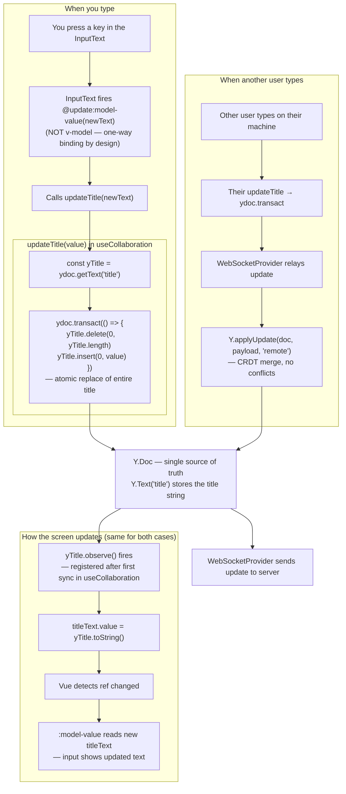

Both paths converge at the Y.Doc. The screen always updates the same way — through the observer, never directly. This is why we don't use `v-model`: it would set `titleText` directly, skipping the Y.Doc entirely, so the change would show on your screen but never reach other users.

- **Connected users indicator** — read-only, uses the Awareness protocol (a lightweight side-channel separate from document content):

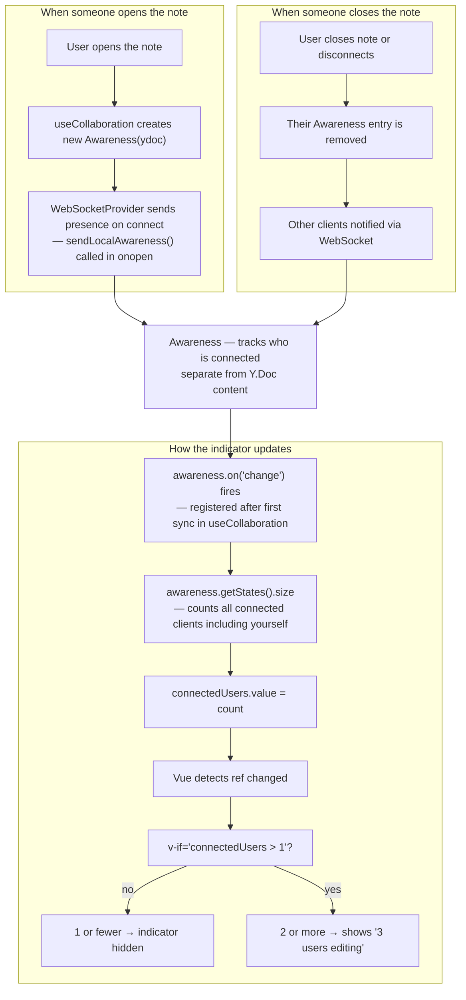

Unlike the title and editor content, the indicator is **read-only** — no user action writes to it. It updates passively whenever someone connects or disconnects.

**Why `shallowRef` for the editor?**

The editor is stored as `const editor = shallowRef<Editor>()`. A beginner might ask: why not a normal `ref`?

- `ref` wraps **everything inside** the object in Vue Proxy objects, all the way down into nested properties. A Tiptap `Editor` is a massive class with hundreds of internal properties (DOM nodes, event handlers, ProseMirror state). Deep-proxying all of that would **break** the editor (its internals don't expect to be proxied) and be **slow** for no benefit.
- `shallowRef` only reacts when you replace `.value` entirely (e.g. `editor.value = newEditor`). It ignores changes inside the object. That's all Vue needs here — to know when the editor instance exists so it can pass it to `<EditorContent>`.

**Rule of thumb:** use `shallowRef` for third-party class instances (editors, maps, charts) that manage their own internal state. Use `ref` for your own simple data.

**Why the editor is created inside `watchEffect` (not immediately):**

The editor needs `ydoc` and `provider` from `useCollaboration`, but those aren't available right away — the WebSocket connection takes time to establish. So the editor **can't** be created at the top level. Instead, `watchEffect` waits for them:

```ts
const editor = shallowRef<Editor>();     // starts as undefined

watchEffect((onCleanup) => {
  const doc = ydoc.value;                // might be undefined at first
  const prov = provider.value;           // might be undefined at first
  if (!doc || !prov) return;             // not ready yet — do nothing

  const ed = new Editor({ ... });        // now we can create the editor
  editor.value = ed;                     // Vue detects this → re-renders template
  onCleanup(() => ed.destroy());         // when noteId changes, destroy old editor
});
```

**Timeline of what happens:**

```
1. Component mounts
   → editor is undefined
   → <EditorContent> renders nothing (blank)

2. watchEffect runs, but ydoc/provider are still undefined
   → early return, still no editor

3. WebSocket connects, useCollaboration provides ydoc + provider
   → watchEffect re-runs automatically (Vue tracks the refs it reads)
   → creates the Editor with collaboration plugins
   → editor.value = ed → Vue re-renders → <EditorContent> shows the editor

4. User switches to a different note (noteId changes)
   → useCollaboration gives new ydoc/provider
   → onCleanup fires → old editor is destroyed
   → watchEffect re-runs → new editor is created for the new note
```

**Why `editor` needs to be a ref at all:**

The template has `<EditorContent :editor="editor" />`. Vue needs to know when `editor` goes from `undefined` to an actual instance so it can re-render. A plain `let editor` variable wouldn't trigger a re-render — Vue only tracks refs.

**Editor plugins:**

| Plugin | What it does |
|---|---|
| StarterKit | Basic formatting — bold, italic, headings, lists, code blocks. Built-in undo/redo is disabled (`undoRedo: false`) because Collaboration provides its own CRDT-aware undo that only reverts *your* changes, not remote edits. |
| Collaboration | Connects the editor to the Y.Doc so edits sync across users |
| CollaborationCaret | Shows colored cursors where other users are typing |

**Lifecycle — what happens when a user interacts:**

1. Parent renders `<NoteEditor :note-id="selectedNote.id" />` (no `:key` — stays mounted)
2. `useCollaboration(() => noteId)` calls `setup(noteId)` — creates Y.Doc, Provider, connects via WebSocket
3. Server sends initial state → composable receives first sync → activates `ydoc`/`provider` refs
4. `watchEffect` in NoteEditor detects new refs → creates Tiptap editor → content displayed
5. User types → keystrokes go into the Y.Doc → WebSocket sends them to server → server sends them to everyone else → their editors update in real time
6. User clicks a different note → `noteId` prop changes → composable's `watch` fires → new connection created, waits for sync → old connection torn down, new editor swapped in seamlessly

#### useCollaboration(() => noteId) — the glue layer

Accepts a reactive getter for the noteId. Creates and owns all CRDT objects, wires Yjs events to Vue refs, and manages lifecycle — including seamless note switching. Never touches WebSocket directly; hands the Y.Doc to the provider and lets it handle transport.

**Reactive note switching — the pending/current pattern:**

When the noteId changes, the composable doesn't tear down immediately. Instead it:
1. Creates a **pending** Y.Doc + Provider and connects
2. Waits for the **first remote sync** (the server's initial state)
3. Only then tears down the **old** connection and activates the new one

This keeps the old editor visible during the transition — no blank flash while the new note loads.

```mermaid
flowchart TB
    subgraph useCollab["useCollaboration#40;#40;#41; => noteId#41;"]
        watchNode["watch#40;noteId, setup, immediate#41;"]

        subgraph setup["setup#40;id#41;"]
            cancel["Cancel any pending connection"]
            create["new Y.Doc + Y.Text#40;'title'#41; + Awareness"]
            connect["new WebSocketProvider → connect#40;#41;"]
            listen["doc.on 'update': wait for origin='remote'"]
        end

        subgraph onFirstSync["On first remote sync"]
            teardown["Tear down old: disconnect + destroy"]
            activate["Activate new: set currentYdoc, currentProvider"]
            observe["Wire observers:<br/>yTitle.observe → titleText<br/>awareness.on change → connectedUsers"]
        end

        titleBridge["titleText ref"]
        usersBridge["connectedUsers ref"]
    end

    watchNode --> cancel
    cancel --> create --> connect --> listen
    listen -- "first remote update arrives" --> teardown --> activate --> observe
    observe --> titleBridge
    observe --> usersBridge
```

- `watch → setup`: Fires immediately and whenever `noteId()` returns a different value. Replaces the old `:key` remount pattern.
- `cancel`: If the user clicks three notes quickly (A→B→C), the pending B connection is torn down before it ever reaches the editor.
- `listen → onFirstSync`: The composable hooks `doc.on("update")` and waits for an update with `origin === "remote"` — that's the server's initial state. Only after receiving it does it proceed.
- `teardown → activate`: The old `currentProvider` is disconnected and old `currentYdoc` is destroyed. Then the new ones are assigned to the exposed `shallowRef`s, which triggers the `watchEffect` in NoteEditor to create a new Tiptap editor.
- `observe → bridges`: Title and connected-users observers are wired only after sync, ensuring `titleText` shows the real title (not empty string).

#### WebSocketProvider — the transport layer

Sends and receives binary Yjs updates over WebSocket. Never touches Vue — only listens to Y.Doc/Awareness events and shuttles `Uint8Array` bytes.

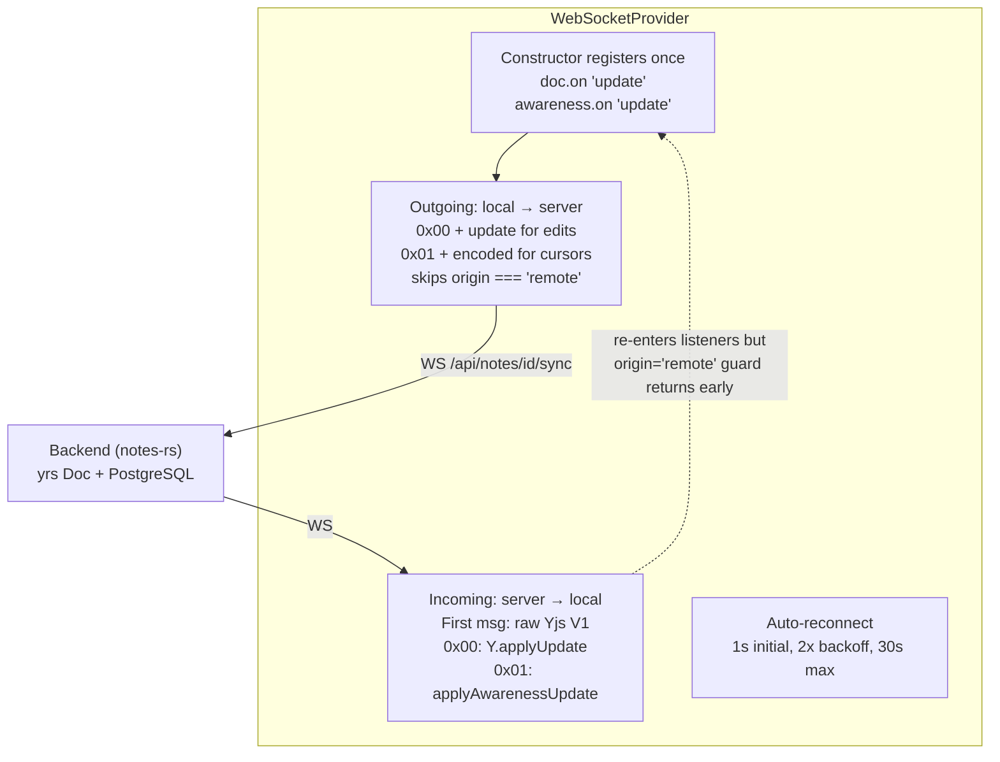

- `listeners → outgoing`: The constructor-registered handlers fire whenever the Y.Doc or Awareness changes locally, producing outgoing messages.
- `outgoing → backend`: Binary messages sent over the WebSocket at `/api/notes/{id}/sync`. The `send()` helper guards on `ws.readyState === OPEN`, making handlers no-ops when disconnected.
- `backend → incoming`: The `onmessage` handler parses incoming bytes. The `"remote"` origin string passed to `Y.applyUpdate` is what the outgoing handler checks — this is how echo loops are prevented.
- `incoming -.-> listeners` (dotted): Applying a remote update fires the doc's `"update"` event, which re-enters `handleDocUpdate` — but the `origin === "remote"` guard returns early, so nothing is sent back.

#### Full wiring — all three layers together

```mermaid
flowchart TB
    subgraph NoteEditor["NoteEditor.vue"]
        call["useCollaboration#40;#40;#41; => noteId#41;"]
        tiptap["Tiptap Editor"]
        title["Title Input"]
        indicator["connectedUsers"]
    end

    subgraph useCollab["useCollaboration#40;#40;#41; => noteId#41;"]
        ydoc["Y.Doc"]
        ytext["Y.Text 'title'"]
        awareness["Awareness"]
        provider_create["new WebSocketProvider"]
        titleBridge["titleText ref"]
        usersBridge["connectedUsers ref"]
    end

    subgraph WSProvider["WebSocketProvider"]
        listeners["doc.on 'update'<br/>awareness.on 'update'"]
        outgoing["Outgoing: local → server"]
        incoming["Incoming: server → local"]
        reconnect["Auto-reconnect"]
    end

    backend["Backend #40;notes-rs#41;<br/>yrs Doc + PostgreSQL"]

    call --> ydoc
    ydoc --> ytext
    ydoc --> awareness
    ydoc --> provider_create
    awareness --> provider_create
    provider_create --> listeners

    ydoc -- "ydoc" --> tiptap
    provider_create -- "provider" --> tiptap
    ytext --> titleBridge
    awareness --> usersBridge
    titleBridge -- "titleText" --> title
    usersBridge -- "connectedUsers" --> indicator

    outgoing -- "WS /api/notes/id/sync" --> backend
    backend -- "WS" --> incoming
```

### Lifecycle

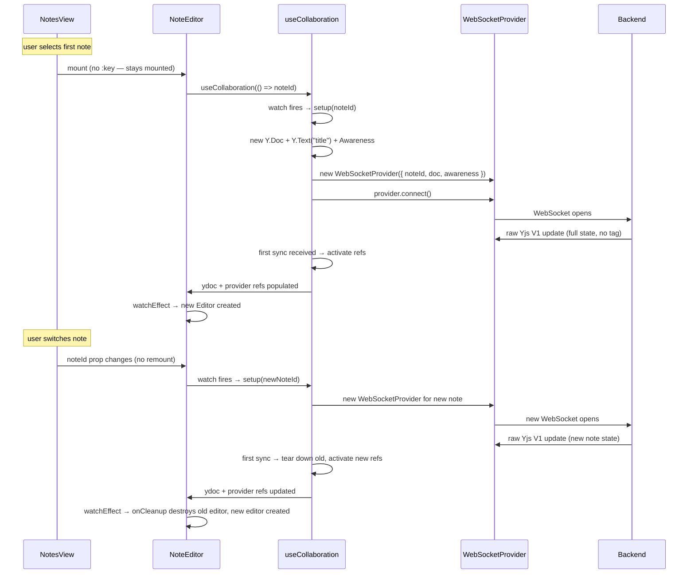

---

## WebSocket Protocol (Custom — NOT y-websocket)

### Why custom?

Our backend uses a simplified binary protocol incompatible with y-websocket. Using the standard library would corrupt data.

### Binary Protocol

```
Tag bytes:
  MSG_SYNC      = 0x00
  MSG_AWARENESS = 0x01
```

### Connection Sequence

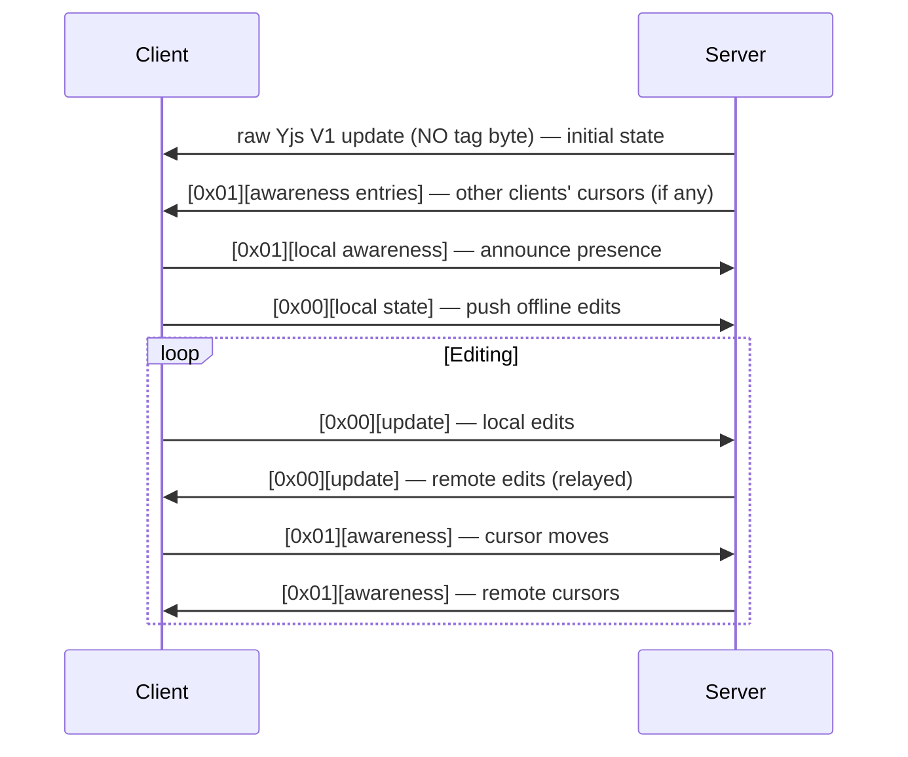

### First-Message Detection (`synced` flag)

The initial state message has **no tag byte** — distinguished from subsequent tagged messages using a `synced` boolean:

```
synced = false  →  treat entire payload as raw Yjs update
                   Y.applyUpdate(doc, data, "remote")
                   synced = true

synced = true   →  read data[0] as tag byte
                   0x00 → Y.applyUpdate(doc, data.slice(1), "remote")
                   0x01 → applyAwarenessUpdate(awareness, data.slice(1))
```

### Origin Tracking (prevents echo loops)

```typescript
// Incoming: mark as "remote"
Y.applyUpdate(this.doc, payload, "remote");

// Outgoing: skip "remote" origin (don't echo back)
handleDocUpdate = (update, origin) => {
  if (origin === "remote") return;
  this.send(MSG_SYNC, update);
};
```

### Reconnection

| Parameter | Value |
|-----------|-------|
| Initial delay | 1000 ms |
| Backoff | 2x per failure |
| Max delay | 30,000 ms |
| Reset | On successful `onopen` |

After reconnect: server sends full state → client applies it → client sends its full local state back (reconciles offline edits via CRDT merge).

---

## Data Flow

### Local Edit

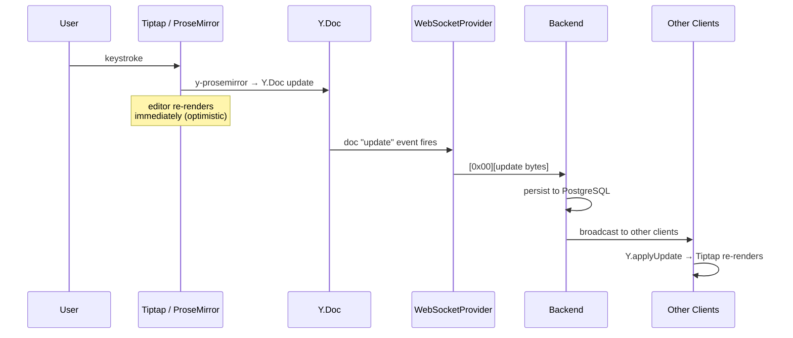

### Remote Edit

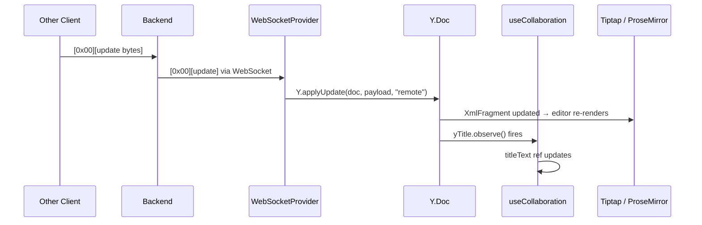

### Create New Note

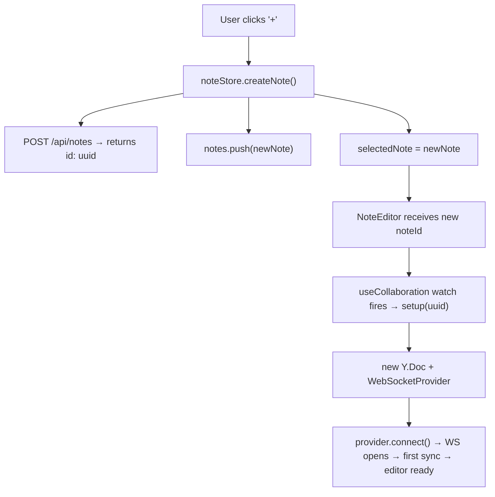

### Open Existing Note

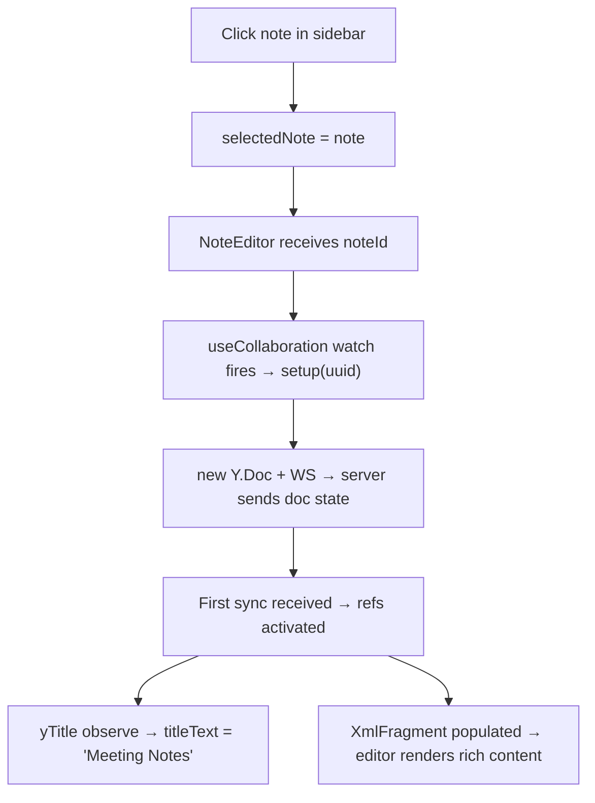

### Switch Notes (seamless swap)

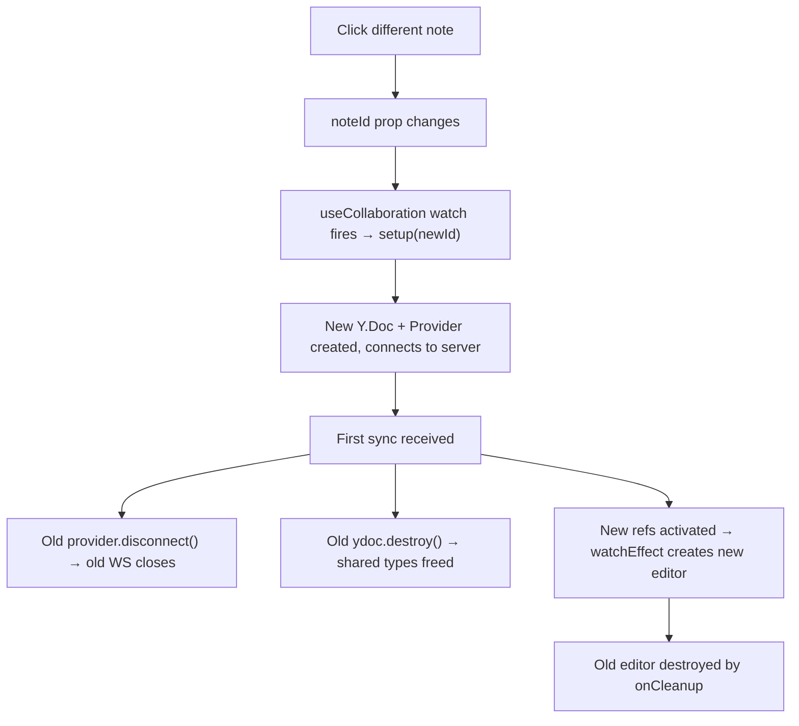

---

## Known Limitations

1. **Sidebar title staleness** — sidebar reads `title_preview` from REST; live Y.Text title changes don't update it until page refresh
2. **Content seeding mismatch** — POST body goes to `Y.Text("content")`, Tiptap uses `XmlFragment("default")`. Moot since we create blank notes.
3. **Anonymous users** — all carets show "Anonymous" with same color. Needs auth integration.
4. **No offline persistence** — local edits survive reconnect (in-memory) but are lost if tab closes while disconnected. Fix: add `y-indexeddb`.
