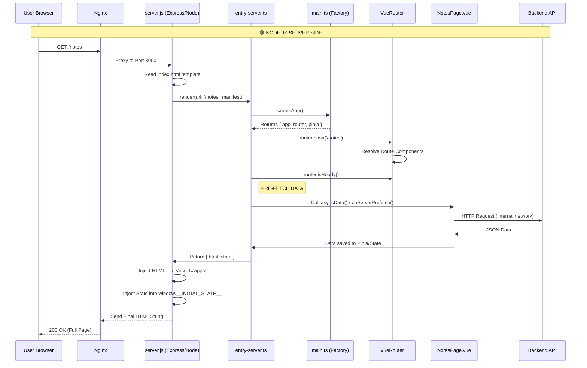

Here is the First Principles breakdown of the Server-Side Rendering (SSR) lifecycle for your application.

When a user visits `localhost:8080/notes`, the request hits **Nginx** first, which acts as the traffic controller. Nginx sees the URL matches the frontend rules and forwards the request to your **Frontend Container** (Node.js/Express+Vite) on port 3000.

Here is exactly what happens inside that Node.js container, millisecond by millisecond:

### 1. The Server Entry (`server.js`)
The request enters your Express/Fastify app. The server sees the path is `/notes`. It does *not* send a static file. Instead, it prepares to build the page dynamically.
*   **Action:** It reads `index.html` (the template) from the file system.
*   **Action:** It loads the server-entry bundle (via Vite).

### 2. App Instantiation (`entry-server.ts`)
The server calls a factory function (usually `createApp()`).
*   **Crucial:** It creates a **fresh** instance of the Vue App, Router, and Pinia Store just for *this specific user request*.
*   *Why?* If we reused a single app instance, User A’s private data might stick in the state and be shown to User B.

### 3. Server-Side Routing
The server takes the URL `/notes` and pushes it to the server-side router.
*   The router checks its configuration.
*   It finds the component matching `/notes` (e.g., `NotesPage.vue`).
*   The server waits for the router to be "ready" (resolving async components).

### 4. The "Pre-Fetch" (Data Loading)
This is the most critical step for SSR.
*   Vue looks at the `NotesPage.vue` component.
*   Does it have an `async setup()` or `onServerPrefetch` hook? Yes.
*   **The Container Talks:** The Node.js server (not the user's browser) makes an HTTP request to your **Notes API** container (e.g., `http://notes_backend:8000/api/notes`).
*   The data comes back JSON-formatted and is stored in the **Pinia Store** or a reactive variable.

### 5. Rendering (The Snapshot)
Now that the data is in memory, Vue calculates the "Virtual DOM" and converts it into a generic HTML string.
*   **HTML Generation:** It turns the Vue component `
` into actual HTML: `
Buy Milk

Walk Dog
`.
*   **State Dehydration:** It takes the data fetched in Step 4 and serializes it into a JSON string, usually attaching it to `window.__INITIAL_STATE__` in the HTML. This is so the browser knows what data the server already found.

### 6. Injection and Response
*   The server takes the `index.html` template.
*   It injects the generated HTML string into the `

` placeholder.
*   It injects the `__INITIAL_STATE__` script.
*   **Final Output:** A complete HTML page is sent back through Nginx to the user's browser.

### 7. Client-Side Hydration (The Handoff)
The user sees the list of notes *immediately* because the HTML is already there. No loading spinners.
*   **Browser:** Downloads `main.js` (the client bundle).
*   **Vue Client:** Starts up in the browser.
*   **Hydration:** Vue sees existing HTML. Instead of destroying it and re-rendering, it "hydrates" it—it attaches event listeners (clicks, inputs) to the existing DOM elements.
*   **State Pickup:** Vue reads `window.__INITIAL_STATE__` so it doesn't need to request the notes checks again immediately.

The page is now fully interactive.

## SSR diagram

### **Visualizing the Hybrid SSR Loop**

This diagram shows the complete lifecycle of a user session, highlighting the critical handoff from the **Server-Side Rendering (SSR)** phase to the **Client-Side Rendering (CSR)** phase.

#### **Legend:**
*   [Actions in Brackets] are internal logic.
*   Arrows (`->`) represent data or control flow.
*   **Bold** represents key architectural components.

---

### **Phase 1: The Initial Entry (SSR)**
*User types `http://localhost:8080/notes` into the URL bar and hits Enter.*

```mermaid
sequenceDiagram
    participant UserBrowser as User Browser
    participant Nginx as Nginx (Gateway)
    participant VueServer as Frontend Container (Node.js)
    participant PiniaServer as Server Pinia Store
    participant API as Notes API Backend

    rect rgb(0, 0, 0)
    Note over UserBrowser, API: 🟢 INITIAL REQUEST (Server-Side Rendering)
    UserBrowser->>Nginx: GET /notes
    Nginx->>VueServer: Proxy Request
    
    VueServer->>VueServer: [1. Create App Instance]
    VueServer->>VueServer: [2. Resolve Route: /notes]
    
    VueServer->>API: [3. Fetch Data] GET /api/notes (Server-to-Server)
    API-->>VueServer: Return JSON Data
    
    VueServer->>PiniaServer: [4. Store Data] Populate Store
    
    VueServer->>VueServer: [5. Render HTML Snapshot]
    Note right of VueServer: Generates <div id="app">...</div>\nand Window.INITIAL_STATE = {...}
    
    VueServer-->>Nginx: Return Full HTML String
    Nginx-->>UserBrowser: Return Full HTML Page
    end
```

---

### **Phase 2: The Handoff (Hydration)**
*The user sees the page, but it's just "paint" (HTML). The "brain" (JS) is waking up.*

```mermaid
sequenceDiagram
    participant UserBrowser as User Browser
    participant VueClient as Vue Client (JS in Browser)
    participant PiniaClient as Client Pinia Store

    rect rgb(0, 0, 0)
    Note over UserBrowser, PiniaClient: 🟡 HYDRATION (The "Wake Up" Phase)
    UserBrowser->>UserBrowser: [1. Parse HTML] Content Visible!
    UserBrowser->>UserBrowser: [2. Download main.js]
    
    UserBrowser->>VueClient: [3. Start Vue]
    VueClient->>UserBrowser: [4. Read Window.INITIAL_STATE]
    UserBrowser-->>PiniaClient: [5. Fill Client Store] (Data Transfer)
    
    VueClient->>UserBrowser: [6. Hydrate DOM] Attach Event Listeners
    Note right of VueClient: Page is now Interactive (Clickable)
    end
```

---

### **Phase 3: The Navigation (CSR)**
*The user clicks a link to `/settings` or adds a new note. The Server is NOT involved in rendering anymore.*

```mermaid
sequenceDiagram
    participant UserBrowser as User Browser
    participant VueClient as Vue Client (JS in Browser)
    participant PiniaClient as Client Pinia Store
    participant API as Notes API Backend

    rect rgb(0, 0, 0)
    Note over UserBrowser, API: 🔵 CLIENT NAVIGATION (Single Page App Mode)
    
    UserBrowser->>VueClient: Click Link: "/settings"
    
    VueClient->>VueClient: [1. Stop Browser Refresh] (e.preventDefault)
    VueClient->>VueClient: [2. Client-Side Route Change]
    
    VueClient->>PiniaClient: [3. Check Data] Do we have settings?
    alt Data Missing / Stale
        VueClient->>API: [4. Fetch Data] GET /api/settings (Browser-to-Server)
        API-->>VueClient: Return JSON
        VueClient->>PiniaClient: [5. Update Store]
    else Data Exists
        PiniaClient-->>VueClient: Return Cached Data
    end
    
    VueClient->>UserBrowser: [6. Update DOM] Swap <Notes> for <Settings>
    Note right of VueClient: Super Fast! No page reload.
    end
```

### **Summary of Difference**

| Feature | Phase 1: SSR (Server) | Phase 3: CSR (Client) |
| :--- | :--- | :--- |
| **Who builds HTML?** | **Node.js Server** (string manipulation) | **Browser** (DOM manipulation) |
| **Data Fetching** | Server-to-API (Private Network) | Browser-to-API (Public Network) |
| **User Experience** | Instant Visuals (First Contentful Paint) | Instant Interaction (No Refresh) |
| **Routing** | Resolves file paths on disk | Manipulates Browser History API |

### **Phase 1: The Initial Entry (SSR) - File Level Detail**
*Scenario: User visits `http://localhost/notes`*

